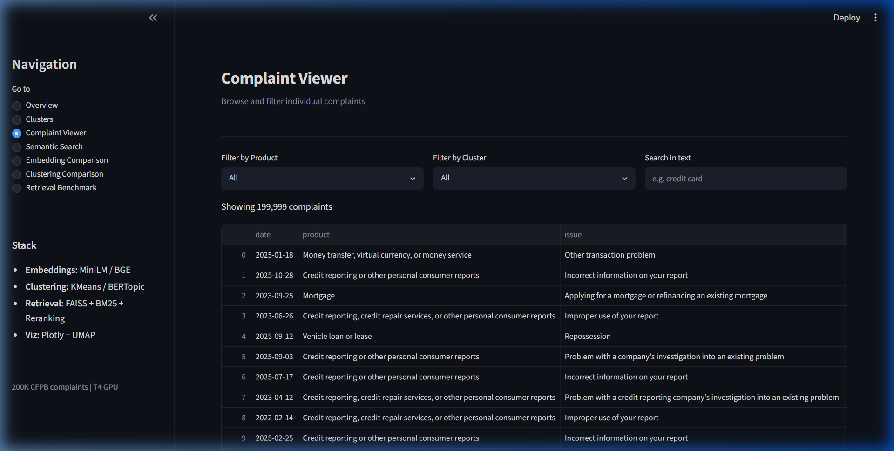
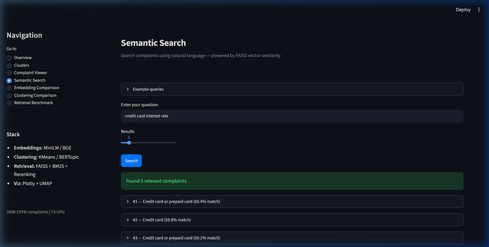
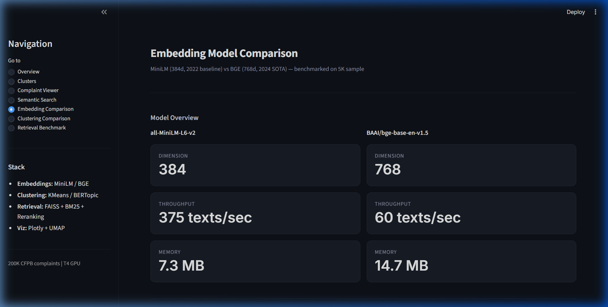
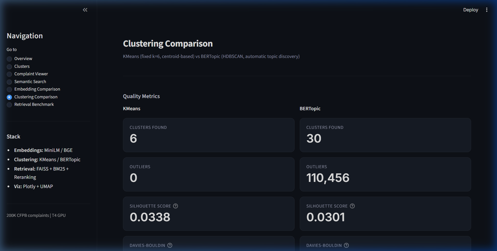
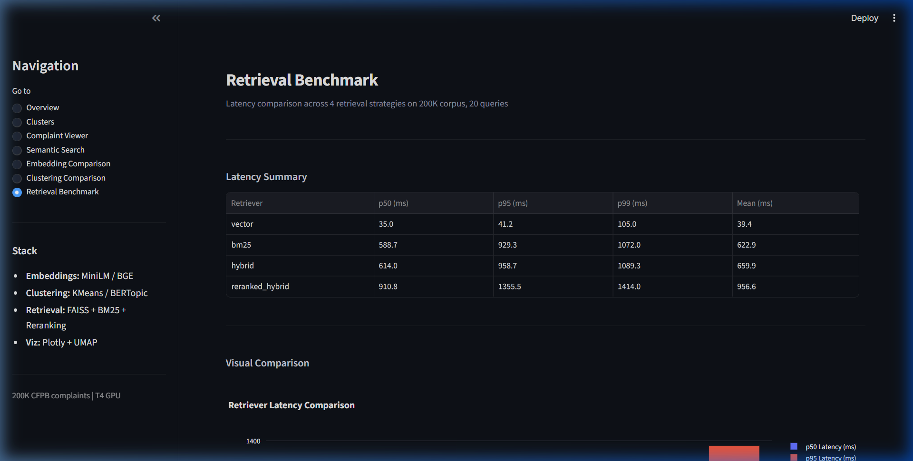

# Complaint Intelligence System

An NLP pipeline that processes 200K consumer complaints from the CFPB database, comparing older and newer techniques for embedding, clustering, and retrieval.


## What it does

Takes raw complaint text, cleans it, generates embeddings with two different models, clusters the complaints using two different methods, and provides a semantic search interface. Everything is benchmarked so you can see the actual tradeoffs.

The pipeline compares:
- **Embeddings**: MiniLM (384d, fast) vs BGE (768d, more accurate)
- **Clustering**: KMeans (fixed k) vs BERTopic (auto-discovers topics)
- **Retrieval**: Vector search, BM25, hybrid, and reranked hybrid

## Results

Ran on 200K complaints using a T4 GPU on Google Colab.

### Embeddings

| Model | Dim | Speed | Cosine Sim (mean) | Intra-cluster Coherence |
|---|---|---|---|---|
| MiniLM | 384 | 374.6 texts/sec | 0.41 | 0.53 |
| BGE | 768 | 59.7 texts/sec | 0.72 | 0.77 |

BGE is 6x slower but produces much tighter clusters. The two models only agree on 38.5% of top-10 neighbors, meaning they capture different aspects of the text.

### Clustering

| Metric | KMeans (k=6) | BERTopic |
|---|---|---|
| Clusters found | 6 | 30 |
| Outliers | 0 | 110,456 (55%) |
| Silhouette | 0.0338 | 0.0301 |

KMeans forces every complaint into a cluster. BERTopic flags 55% as noise, which is honest but means over half the data gets no label. Both have low silhouette scores, which makes sense since complaint text is messy and overlapping.

### Retrieval latency

| Method | p50 (ms) | p95 (ms) |
|---|---|---|
| Vector (FAISS) | 35 | 41 |
| BM25 | 589 | 929 |
| Hybrid (RRF) | 614 | 959 |
| Reranked Hybrid | 911 | 1,356 |

Pure vector search is fast. Adding BM25 and reranking improves result quality but adds significant latency. Whether that tradeoff is worth it depends on the use case.

## How to run

### Setup

```bash
git clone https://github.com/AswaniSahoo/complaint-intelligence-system.git
cd complaint-intelligence-system

python -m venv .venv
.venv\Scripts\activate        # Windows
# source .venv/bin/activate   # Linux/Mac

pip install -r requirements.txt
```

### Get the data

Download from the [CFPB website](https://www.consumerfinance.gov/data-research/consumer-complaints/) and put it in `data/raw/complaints.csv`.

### Run the pipeline

```bash
# Full run with both models and benchmarks
python run_pipeline.py --sample-size 200000 --model both --clustering both --benchmark

# Quick run (MiniLM + KMeans only)
python run_pipeline.py

# With LLM summarization (needs GEMINI_API_KEY in .env)
python run_pipeline.py --with-llm
```

### Launch the dashboard

```bash
streamlit run app/app.py
```

### Running on Colab

For large runs, use Colab with a T4 GPU. The full pipeline notebook is at `notebooks/Full_pipeline_output.ipynb`.

```python
!git clone https://github.com/AswaniSahoo/complaint-intelligence-system.git
%cd complaint-intelligence-system
!pip install -r requirements.txt -q

!mkdir -p data/raw
!wget -q -O data/raw/complaints.csv.zip \
    "https://files.consumerfinance.gov/ccdb/complaints.csv.zip"
!cd data/raw && unzip -o complaints.csv.zip && rm complaints.csv.zip

!python run_pipeline.py --sample-size 200000 --model both --clustering both --benchmark
```

## Pipeline flags

| Flag | What it does | Default |
|---|---|---|
| `--sample-size N` | How many complaints to process | 15000 |
| `--model {minilm,bge,both}` | Which embedding model(s) | minilm |
| `--clustering {kmeans,bertopic,both}` | Which clustering method(s) | kmeans |
| `--benchmark` | Run retrieval latency tests | off |
| `--with-llm` | Generate LLM summaries | off |
| `--provider {gemini,groq,together}` | LLM provider | gemini |

## Dashboard

7 pages:

- **Overview** - complaint counts, product/issue distributions, time trends
- **Clusters** - drill into each cluster, see what products/issues it contains
- **Complaint Viewer** - browse and filter individual complaints
- **Semantic Search** - search complaints by meaning using FAISS
- **Embedding Comparison** - MiniLM vs BGE metrics side by side
- **Clustering Comparison** - KMeans vs BERTopic quality metrics
- **Retrieval Benchmark** - latency comparison across all four retrievers

<details>
<summary>Screenshots</summary>

### Cluster Analysis


### Complaint Viewer


### Semantic Search


### Embedding Comparison


### Clustering Comparison


### Retrieval Benchmark


</details>

## Project structure

```
├── app/
│   └── app.py                     # Streamlit dashboard
├── src/
│   ├── preprocess.py              # Text cleaning
│   ├── embeddings.py              # Embedding generation (MiniLM + BGE)
│   ├── embedding_benchmark.py     # Embedding comparison metrics
│   ├── clustering.py              # KMeans + BERTopic
│   ├── topic_labeler.py           # LLM-based topic labeling
│   ├── rag.py                     # FAISS-based search
│   ├── llm_utils.py               # LLM provider abstraction
│   ├── visualizer.py              # UMAP projections
│   ├── retrievers/
│   │   ├── base.py                # Retriever interface
│   │   ├── vector_retriever.py    # FAISS search
│   │   ├── bm25_retriever.py      # BM25 keyword search
│   │   ├── hybrid_retriever.py    # Vector + BM25 fusion
│   │   ├── reranker.py            # Cross-encoder reranking
│   │   └── reranked_retriever.py  # Two-stage retrieval
│   └── evaluation/
│       └── retrieval_benchmark.py # Latency benchmarks
├── data/
│   ├── raw/                       # CFPB data (not committed)
│   ├── processed/                 # Cleaned data + embeddings
│   └── results/                   # Benchmark outputs (JSON)
├── notebooks/
│   └── Full_pipeline_output.ipynb # Complete Colab run
├── tests/
├── run_pipeline.py                # Main pipeline script
└── requirements.txt
```

## Tech stack

- `sentence-transformers` for embeddings
- `bertopic`, `hdbscan`, `umap-learn` for topic modeling
- `faiss-cpu` for vector search
- `rank-bm25` for keyword search
- `cross-encoder/ms-marco-MiniLM-L-6-v2` for reranking
- `streamlit` + `plotly` for the dashboard
- Google Gemini for topic labeling (optional)

## License

MIT
