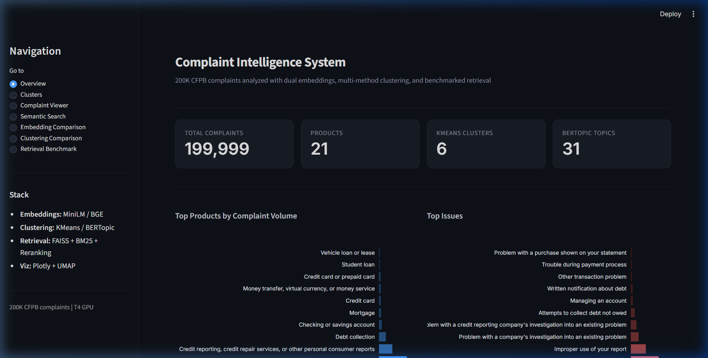
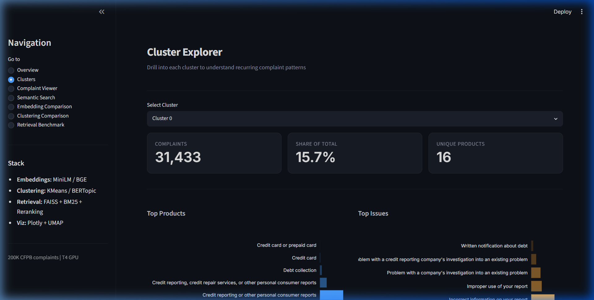
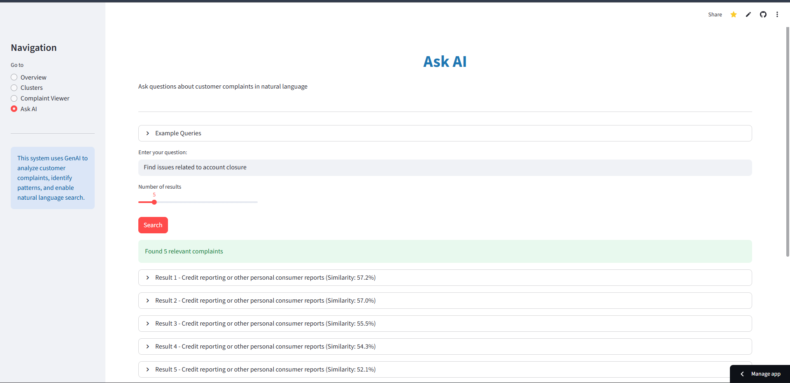

# Customer Complaint Intelligence System

[](https://www.python.org/)
[](https://streamlit.io/)
[](LICENSE)
[](https://github.com/AswaniSahoo/complaint-intelligence-system)

## Overview

The **Customer Complaint Intelligence System** is a GenAI-powered application that analyzes, clusters, and extracts insights from customer complaints. By using advanced NLP techniques like embeddings and Large Language Models (LLMs), it transforms raw text into actionable intelligence.

**Live Demo:** [Click Here to View App](https://complaint-intelligence-system.streamlit.app/)

## Key Features

- **Automated Cleaning**: Preprocesses raw complaint text automatically
- **Semantic Clustering**: Groups similar complaints using sentence embeddings and KMeans
- **AI Summarization**: Generates concise summaries and categories using Gemini or Groq
- **Smart Search**: Find specific complaints using natural language queries (RAG)
- **Interactive Dashboard**: Explore data through a user-friendly Streamlit interface
- **GPU Acceleration**: Auto-detects CUDA for faster embedding generation

## Tech Stack

- **Python** (Logic & Data Processing)
- **Streamlit** (User Interface)
- **Sentence Transformers** (Embeddings with GPU support)
- **FAISS** (Vector Database)
- **Gemini API / Groq API** (LLM Intelligence)

## Screenshots

### Dashboard


### Clusters


### Smart Search


## Getting Started

### 1. Installation

Clone the repository and install the required packages:

```bash
git clone https://github.com/AswaniSahoo/complaint-intelligence-system.git
cd complaint-intelligence-system
pip install -r requirements.txt
```

### 2. Setup Keys

Create a `.env` file in the root directory and add your API key:

```bash
GEMINI_API_KEY="your-gemini-api-key"
```

### 3. Run the Pipeline

Process the raw data:

```bash
python run_pipeline.py
```

### 4. Launch Dashboard

```bash
streamlit run app/app.py
```

Open your browser to `http://localhost:8501`.

## Architecture

```
                    DATA PROCESSING PIPELINE
+------------------------------------------------------------------+
|                                                                  |
|  Raw CSV --> Preprocess --> Embeddings --> Clustering --> LLM   |
|  (CFPB)    (clean text)   (MiniLM/GPU)   (KMeans)      (Gemini) |
|                                                                  |
+------------------------------------------------------------------+
                      STREAMLIT DASHBOARD
+------------------------------------------------------------------+
|                                                                  |
|  Overview ---> Clusters ---> Viewer ---> Ask AI (RAG)           |
|  (metrics)    (drilldown)   (filter)    (FAISS search)          |
|                                                                  |
+------------------------------------------------------------------+
```

## Contributing

Contributions are welcome! Please see [CONTRIBUTING.md](CONTRIBUTING.md) for details.

## License

This project is licensed under the [MIT License](LICENSE).

## Author

**Aswani Sahoo**  
Aspiring Data Scientist | Machine Learning Enthusiast

[](https://www.linkedin.com/in/aswanisahoo/)
[](https://github.com/AswaniSahoo)

## Acknowledgments

- [CFPB Consumer Complaint Database](https://www.consumerfinance.gov/data-research/consumer-complaints/) for the dataset
- [Sentence Transformers](https://www.sbert.net/) for embeddings
- [Google Gemini](https://ai.google.dev/) for LLM summarization
