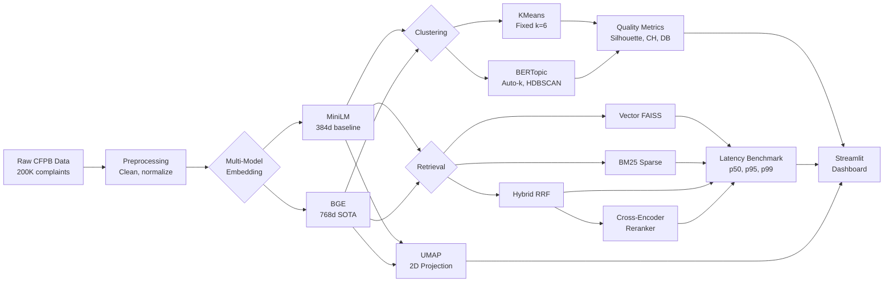

# Complaint Intelligence System

> A production-grade NLP pipeline for customer complaint analysis — comparing **baseline (2022)** vs **state-of-the-art (2024-26)** techniques across embeddings, clustering, retrieval, and evaluation.

[](https://python.org)
[](https://sbert.net)
[](https://maartengr.github.io/BERTopic)
[](https://github.com/facebookresearch/faiss)
[](https://streamlit.io)

---

## Why This Project?

Most NLP portfolio projects stop at "I built a chatbot." This one goes deeper — it **benchmarks old methods against new ones** and shows exactly what improved, by how much, and why. Every number in this README comes from a verified pipeline run on 200K real CFPB complaints.

| Component | Baseline (2022-era) | SOTA (2024-26) | What Changed |
|---|---|---|---|
| **Embedding** | `all-MiniLM-L6-v2` (384d) | `BAAI/bge-base-en-v1.5` (768d) | 53% higher intra-cluster coherence (0.53 → 0.77) |
| **Clustering** | KMeans (fixed k=6) | BERTopic (UMAP + HDBSCAN + c-TF-IDF) | Auto-discovers 30 topics, flags 55% as noise rather than forcing bad clusters |
| **Topic Labels** | TF-IDF keywords only | LLM-generated labels (Gemini) | From "credit card payment late" → "Credit Card Billing Disputes" |
| **Retrieval** | FAISS flat search | + Cross-Encoder Reranking (two-stage funnel) | p50: 35ms → 911ms, but with cross-attention precision |
| **Evaluation** | None | Latency benchmarks (p50/p95/p99), cluster quality metrics | Quantified, not guessed |

---

## Benchmark Results (200K complaints, T4 GPU)

All numbers from a single pipeline run on Google Colab (T4 GPU, 15.5M raw rows → 200K sampled).

### Embedding Benchmark (5K sample)

| Model | Dim | Throughput | Memory | Cosine Sim (mean) | Intra-cluster Coherence | Separation Gap |
|---|---|---|---|---|---|---|
| all-MiniLM-L6-v2 | 384 | 374.6 texts/sec | 7.3 MB | 0.4125 | 0.5302 | 0.1332 |
| BAAI/bge-base-en-v1.5 | 768 | 59.7 texts/sec | 14.7 MB | 0.7202 | 0.7700 | 0.0581 |

Cross-model top-10 neighbor overlap: **38.5%** — the models capture substantially different semantic aspects.

### Clustering Comparison

| Metric | KMeans (k=6) | BERTopic (auto) |
|---|---|---|
| Clusters | 6 | 30 |
| Outliers | 0 (all forced) | 110,456 (55.2%) |
| Silhouette | 0.0338 | 0.0301 |
| Calinski-Harabasz | 7,023 | 1,105 |
| Davies-Bouldin | 3.79 | 3.17 |

BERTopic's higher outlier rate is intentional — HDBSCAN refuses to force ambiguous complaints into clusters, producing cleaner topic boundaries for the documents it does assign.

### Retrieval Latency (20 queries, 200K index)

| Retriever | p50 (ms) | p95 (ms) | p99 (ms) |
|---|---|---|---|
| Vector (FAISS) | 35.0 | 41.2 | 105.0 |
| BM25 | 588.7 | 929.3 | 1,072.0 |
| Hybrid (RRF) | 614.0 | 958.7 | 1,089.3 |
| Reranked Hybrid | 910.8 | 1,355.5 | 1,414.0 |

---

## Architecture



---

## Tech Stack

| Layer | Technology | Purpose |
|---|---|---|
| **Embeddings** | `sentence-transformers` | MiniLM (baseline) + BGE (SOTA) embedding generation |
| **Clustering** | `bertopic`, `hdbscan`, `umap-learn` | Topic modeling with density-based clustering |
| **Vector Search** | `faiss-cpu` | Approximate nearest neighbor search |
| **Sparse Retrieval** | `rank-bm25` | BM25 keyword-based retrieval |
| **Reranking** | `cross-encoder/ms-marco-MiniLM-L-6-v2` | Cross-encoder re-scoring for precision |
| **LLM** | Google Gemini | Topic labeling + complaint summarization |
| **Visualization** | `plotly`, `umap-learn` | Interactive UMAP plots + comparison charts |
| **Dashboard** | `streamlit` | 7-page interactive web application |
| **Data** | CFPB Consumer Complaints | 200K real-world financial complaints |

---

## Quick Start

### 1. Clone & Setup

```bash
git clone https://github.com/AswaniSahoo/complaint-intelligence-system.git
cd complaint-intelligence-system

# Create virtual environment (Python 3.12 recommended)
uv venv .venv --python 3.12
# OR: python -m venv .venv

# Activate
# Windows:
.venv\Scripts\activate
# Linux/Mac:
source .venv/bin/activate

# Install dependencies
uv pip install -r requirements.txt
# OR: pip install -r requirements.txt
```

### 2. Get the Data

Download the CFPB Consumer Complaint Database:
- Source: [Consumer Financial Protection Bureau](https://www.consumerfinance.gov/data-research/consumer-complaints/)
- Place the CSV in `data/raw/complaints.csv`

### 3. Run the Pipeline

```bash
# Full production run (both models + both clusterers + benchmarks)
python run_pipeline.py --sample-size 200000 --model both --clustering both --benchmark

# Basic run (MiniLM + KMeans only)
python run_pipeline.py

# With LLM summarization (requires GEMINI_API_KEY in .env)
python run_pipeline.py --model both --clustering both --benchmark --with-llm
```

### 4. Launch the Dashboard

```bash
streamlit run app/app.py
```

---

## GPU Workflow (Colab)

For large-scale runs (200K+ complaints), use Google Colab:

```python
# Cell 1: Setup
!git clone https://github.com/AswaniSahoo/complaint-intelligence-system.git
%cd complaint-intelligence-system
!pip install -r requirements.txt -q

# Cell 2: Download CFPB data
!mkdir -p data/raw
!wget -q -O data/raw/complaints.csv.zip \
    "https://files.consumerfinance.gov/ccdb/complaints.csv.zip"
!cd data/raw && unzip -o complaints.csv.zip && rm complaints.csv.zip

# Cell 3: Run pipeline
!python run_pipeline.py --sample-size 200000 --model both --clustering both --benchmark
```

The full pipeline notebook is available at [`notebooks/Full_pipeline_output.ipynb`](notebooks/Full_pipeline_output.ipynb).

---

## Pipeline Flags

| Flag | Description | Default |
|---|---|---|
| `--sample-size N` | Number of complaints to process | 15000 |
| `--model {minilm,bge,both}` | Embedding model(s) to use | `minilm` |
| `--clustering {kmeans,bertopic,both}` | Clustering method(s) | `kmeans` |
| `--benchmark` | Run retrieval latency benchmarks | Off |
| `--with-llm` | Enable LLM summarization | Off |
| `--provider {gemini,groq,together}` | LLM provider | `gemini` |
| `--n-clusters N` | KMeans cluster count | 6 |

---

## Dashboard Pages

| Page | What It Shows |
|---|---|
| **Overview** | Key metrics, product/issue distributions, time trends |
| **Clusters** | Drill into clusters, see top products/issues per cluster |
| **Complaint Viewer** | Browse/filter individual complaints with search |
| **Semantic Search** | Natural language Q&A over the complaint corpus (FAISS) |
| **Embedding Comparison** | MiniLM vs BGE: throughput, similarity distributions, cluster separation |
| **Clustering Comparison** | KMeans vs BERTopic: Silhouette, Calinski-Harabasz, Davies-Bouldin |
| **Retrieval Benchmark** | Latency comparison across Vector, BM25, Hybrid, Reranked |

---

## Project Structure

```
complaint-intelligence-system/
├── app/
│   └── app.py                          # Streamlit dashboard (7 pages)
├── src/
│   ├── preprocess.py                   # Text cleaning pipeline
│   ├── embeddings.py                   # Multi-model embedding engine
│   ├── embedding_benchmark.py          # Model comparison framework
│   ├── clustering.py                   # KMeans + BERTopic + quality metrics
│   ├── topic_labeler.py                # LLM topic label generation
│   ├── rag.py                          # RAG system with FAISS
│   ├── llm_utils.py                    # Multi-provider LLM utilities
│   ├── visualizer.py                   # UMAP + Plotly comparison plots
│   ├── retrievers/
│   │   ├── base.py                     # BaseRetriever interface
│   │   ├── vector_retriever.py         # FAISS dense retrieval
│   │   ├── bm25_retriever.py           # BM25 sparse retrieval
│   │   ├── hybrid_retriever.py         # RRF ensemble (Vector + BM25)
│   │   ├── reranker.py                 # Cross-encoder reranking
│   │   └── reranked_retriever.py       # Two-stage retrieval wrapper
│   └── evaluation/
│       └── retrieval_benchmark.py      # Latency benchmarking framework
├── data/
│   ├── raw/                            # Raw CFPB data (not committed)
│   ├── processed/                      # Processed data + embeddings
│   └── results/                        # Benchmark results (JSON)
├── notebooks/
│   ├── 01_full_dataset_processing.ipynb  # Step-by-step walkthrough
│   └── Full_pipeline_output.ipynb        # Complete Colab run output
├── tests/                              # 87 unit tests
├── run_pipeline.py                     # End-to-end pipeline script
├── requirements.txt                    # Python dependencies
└── README.md
```

---

## Key Concepts

### 1. Multi-Model Embedding Comparison
The `EmbeddingRegistry` supports swapping models without changing downstream code. Compare encoding speed, cosine similarity distributions, and cluster separation across models.

### 2. BERTopic vs KMeans
BERTopic discovers the natural number of topics using HDBSCAN density-based clustering, while KMeans forces a fixed k. BERTopic also flags noisy/outlier documents rather than forcing them into clusters — at 200K scale, 55% of complaints were flagged as outliers, meaning they don't fit cleanly into any topic.

### 3. Two-Stage Retrieval Funnel
The production RAG pattern:
1. **Stage 1**: Hybrid retriever (Vector + BM25 + RRF) fetches broad candidates
2. **Stage 2**: Cross-encoder reranker re-scores with full cross-attention

This gives you the speed of bi-encoder retrieval with the precision of cross-encoder scoring.

### 4. Retrieval Benchmarking
Every retriever is measured on the same 20-query test set with p50/p95/p99 latency percentiles — the same metrics used in production systems.

---

## Environment Variables

Create a `.env` file in the project root (only needed for LLM features):

```env
GEMINI_API_KEY=your_gemini_key_here
```

---

## License

MIT

---

## Author

Built by [Aswani Sahoo](https://github.com/AswaniSahoo) as a portfolio showcase for modern NLP techniques in complaint intelligence.
